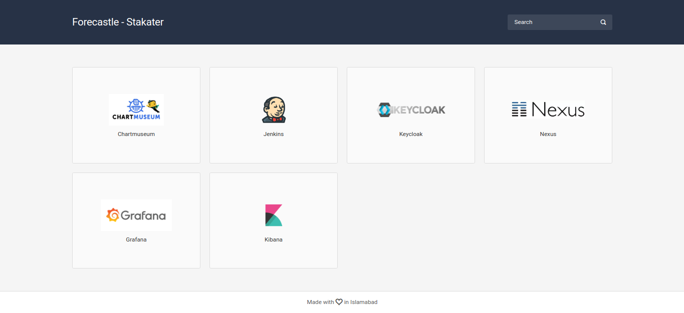

#  Forecastle

[](https://stakater.com/?utm_source=IngressMonitorController&utm_medium=github)

## Table of Contents:

- [Introduction](#introduction)
  - [Problem](#problem)
  - [Solution](#solution)
- [Features](#features)
- [Admin Guide](#admin-guide)
  - [Vanilla Manifests](#vanilla-manifests)
  - [Helm Charts](#helm-charts)
  - [Configuration](#configuration)
    - [NamespaceSelector](#namespaceselector)
    - [Custom Apps](#custom-apps)
    - [Example Config](#example-configuration)
  - [Scaling with Multiple Instances](#scaling-with-multiple-instances)
- [User Guide](#user-guide)
  - [Ingresses](#ingresses)
  - [ForecastleApp CRD](#forecastleapp-crd)
  - [Automatically discover URL's from Kubernetes Resources](#automatically-discover-urls-from-kubernetes-resources)
- [Developer Guide](#developer-guide)
  - [Bug Reports & Feature Requests](#bug-reports--feature-requests)
  - [Developing](#developing)
- [Releasing](#releasing)
- [Help](#help)
  - [Talk to us on Slack](#talk-to-us-on-slack)
- [Changelog](#changelog)
- [License](#license)
- [About](#about)
  - [Why name Forecastle](#why-the-name-forecastle)


## Introduction
### Problem

- Finding and accessing applications on Kubernetes can be challenging without a central hub.
- It's essential to have a dynamic way to discover and list applications that are actively running on Kubernetes.
- Developers often need a streamlined portal to access essential tools like Jenkins, Nexus, Kibana, Grafana, and others.

### Solution

Forecastle gives you access to a control panel where you can see your running applications and access them on Kubernetes.

Forecastle provides a unified control panel, serving as a convenient gateway to view and access your applications deployed on Kubernetes. Whether it's monitoring tools, CI/CD pipelines, or other applications, Forecastle brings them all to your fingertips in one central location.



## Features

Forecastle boasts a range of functionalities designed to streamline the management and accessibility of applications in Kubernetes environments. Key features include:

1. **Comprehensive App Listing**: Forecastle aggregates and displays apps from all namespaces specified in the ConfigMap, providing a centralized view of your resources.

2. **Search Functionality**: Quickly locate specific applications with an intuitive search feature, enhancing user experience and efficiency.

3. **Namespace Grouping**: Apps are neatly organized and grouped by their respective namespaces, making navigation and management more straightforward.

4. **Customizable Header**: Tailor the look and feel of your Forecastle dashboard with configurable header options, including title customization and color schemes.

5. **Support for Multiple Instances**: Forecastle is designed to support multiple instances, accommodating varied and complex deployment scenarios.

6. **Custom Apps Integration**: Easily add non-Kubernetes or external applications to your dashboard for a more comprehensive overview of your tools and resources.

7. **ForecastleApp CRD**: Utilize the ForecastleApp Custom Resource Definition to dynamically add custom applications, further enhancing the dashboard's flexibility.

8. **Custom Grouping and URLs**: Organize your applications into custom groups and assign specific URLs for tailored navigation and accessibility.

9. **Detailed App Information**: Each application comes with detailed information, offering insights and essential details at a glance.

10. **Light/Dark Theme**: Switch between light and dark themes with automatic system preference detection.

11. **Grid/List Views**: Toggle between grid and list views for different ways to visualize your applications.

## Admin Guide

This section is intended for Administrators aiming to deploy Forecastle on their clusters. Forecastle offers flexible deployment options, accommodating both Kubernetes and OpenShift platforms with ease.

You have the choice of deploying Forecastle using traditional manifests or through Helm charts. Detailed instructions for both methods are provided below to guide you through the deployment process.

### Vanilla Manifests

#### Step 1: Apply manifests

You can get Forecastle by running the following command on your cluster:

**For Kubernetes** (vanilla Kubernetes, EKS, GKE, AKS, etc.):
```bash
kubectl apply -f https://github.com/stakater/Forecastle/releases/latest/download/forecastle-kubernetes.yaml
```

**For OpenShift** (includes OpenShift Route for external access):
```bash
kubectl apply -f https://github.com/stakater/Forecastle/releases/latest/download/forecastle-openshift.yaml
```

##### Accessing the Dashboard

For Kubernetes environments, you can use the following port-foward command to access the Forecastle dashboard: 
```bash
kubectl port-forward svc/forecastle 8080:8080
```

Please note that you would need to configure ingress to to access Forecastle from outside the cluster based on your cluster's ingress configuration.

For OpenShift environments, a default route is created for the Forecastle service. You can access the dashboard using the route URL.

```bash
oc get route forecastle
```

#### Step 2: Update configmap

Modify the `namespaceSelector` key in the Forecastle ConfigMap to list the namespaces you want Forecastle to monitor. For detailed instructions, see [namespace selector configuration](#namespaceselector) for instructions.

### Helm Charts

You can use Helm to deploy Forecastle. Head over to the [values.yaml](./deployments/kubernetes/chart/forecastle/values.yaml) to find configuration options.

```shell
helm repo add stakater-charts https://stakater.github.io/stakater-charts/
helm install forecastle stakater-charts/forecastle
```

### Configuration

Forecastle simplifies the discovery and management of applications on Kubernetes and OpenShift. It utilizes specific annotations on ingresses and offers various configuration options for customization.

You can customize Forecastle using either a ConfigMap or the values.yaml file when deploying with Helm. Below are the configurable fields:

|       Field       |                                                Description                                                 |         Default         | Type              |
| :---------------: | :--------------------------------------------------------------------------------------------------------: | :---------------------: | ----------------- |
| namespaceSelector | A fine grained namespace selector which uses a combination of hardcoded namespaces well as label selectors |        any: true        | NamespaceSelector |
| headerBackground  |                         Background color of the header (Specified in the CSS way)                          |          null           | string            |
| headerForeground  |                         Foreground color of the header (Specified in the CSS way)                          |          null           | string            |
|       title       |                                     Title for the forecastle dashboard                                     | "Forecastle - Stakater" | string            |
|   instanceName    |                                      Name of the forecastle instance                                       |           ""            | string            |
|    customApps     |                A list of custom apps that you would like to add to the forecastle instance                 |           {}            | []CustomApp       |
|    crdEnabled     |                                  Enables or disables `ForecastleApp` CRD                                   |          true           | bool              |
|     basePath      |  Base path for subpath hosting (e.g., "/forecastle"). Auto-detected from X-Forwarded-Prefix if not set    |           ""            | string            |

#### Detailed Configurations

##### NamespaceSelector

Selects namespaces for Forecastle to monitor, either by listing specific namespaces or using label selectors.

|     Field     |                                          Description                                          | Default | Type                                                                                         |
| :-----------: | :-------------------------------------------------------------------------------------------: | :-----: | -------------------------------------------------------------------------------------------- |
|      any      | Boolean describing whether all namespaces are selected in contrast to a list restricting them |  false  | bool                                                                                         |
| labelSelector |                Filter namespaces based on kubernetes metav1.LabelSelector type                |  null   | [metav1.LabelSelector](https://godoc.org/k8s.io/apimachinery/pkg/apis/meta/v1#LabelSelector) |
|  matchNames   |                                    List of namespace names                                    |  null   | []string                                                                                     |

*Note:* If you specify both `labelSelector` and `matchNames`, Forecastle will take a union of all namespaces matched and use them.

##### Custom Apps

Allows adding non-Kubernetes or external apps to Forecastle. This is an extremely useful feature especially when your apps are distributed both on kubernetes and off it. You can pass an array of custom apps inside the config.

| Field             | Description                               | Type              |
| ----------------- | ----------------------------------------- | ----------------- |
| name              | Name of the custom app                    | String            |
| icon              | URL of the icon for the custom app        | String            |
| url               | URL of the custom app                     | String            |
| group             | Group for the custom app                  | String            |
| properties        | Additional Properties of the app as a map | map[string]string |
| networkRestricted | Whether app is network restricted or not  | bool              |

#### Example Configuration

Below is an example of how you might configure Forecastle using a combination of namespace selectors and custom apps:

```yaml
namespaceSelector:
  labelSelector:
    matchLabels:
      component: redis
    matchExpressions:
      - {key: tier, operator: In, values: [cache]}
  matchNames:
  - test
title:
headerBackground:
headerForeground: "#ffffff"
instanceName: "Hello"
crdEnabled: false
customApps:
- name: Hello
  icon: http://hello
  url: http://helloicon
  group: Test
  properties:
    Version: 1.0
```

This configuration demonstrates how to set namespace selectors, customize the header's appearance, enable or disable the CRD feature, and add a custom app with specific properties.


### Scaling with Multiple Instances

Forecastle's design allows for running multiple instances, providing scalability and flexibility in diverse environments. Here's how you can effectively scale Forecastle.

#### Deploying Multiple Instances

*Basic Deployment*: To run multiple Forecastle instances, deploy each instance in a separate namespace. Specify a list of namespaces for each instance to monitor ingresses.

#### Configuring Named Instances for Enhanced Flexibility

*Named Instance Configuration*: For greater control over which applications are displayed in specific instances (irrespective of their namespaces), configure each Forecastle instance with a unique name using the `instanceName` setting in the Forecastle configuration.

#### Controlling Application Display Across Instances

*Application-Specific Instance Display*: After naming your instances, use the `forecastle.stakater.com/instance` annotation on your ingresses. This annotation dictates which application appears in which Forecastle instance.

*Multiple Instance Display*: It's possible for a single application (ingress) to appear in multiple Forecastle dashboards. For instance, if you have two instances named dev-dashboard and prod-dashboard, adding `dev-dashboard,prod-dashboard` in the ingress's instance annotation will ensure the application is visible on both dashboards.

#### Helm Deployment Considerations

*Unique Naming in Helm*: When deploying Forecastle instances via Helm, ensure each instance has a unique `nameOverride` value (default is forecastle). This step is crucial to avoid conflicts between global resources like ClusterRole and ClusterRoleBinding.

## User Guide

This section is intended for Users aiming to use Forecastle in their Kubernetes environments.  

### Ingresses

Forecastle identifies applications through annotations added to Kubernetes ingresses. Here’s how you would add the necessary annotations:

| Annotation                                   | Description                                                                                                                                                 | Required |
| -------------------------------------------- | ----------------------------------------------------------------------------------------------------------------------------------------------------------- | -------- |
| `forecastle.stakater.com/expose`             | Add this with value `true` to the ingress of the app you want to show in Forecastle                                                                         | `true`   |
| `forecastle.stakater.com/icon`               | Icon/Image URL of the application; An icons/logos/images collection repo [Icons](https://github.com/stakater/ForecastleIcons)                               | `false`  |
| `forecastle.stakater.com/appName`            | A custom name for your application. Use if you don't want to use name of the ingress                                                                        | `false`  |
| `forecastle.stakater.com/group`              | A custom group name. Use if you want the application to show in a different group than the namespace it is running in                                       | `false`  |
| `forecastle.stakater.com/instance`           | A comma separated list of name/s of the forecastle instance/s where you want this application to appear. Use when you have multiple forecastle dashboards   | `false`  |
| `forecastle.stakater.com/url`                | A URL for the forecastle app (This will override the ingress URL). It MUST begin with a scheme i.e., `http://` or `https://`                                | `false`  |
| `forecastle.stakater.com/properties`         | A comma separate list of `key:value` pairs for the properties. This will appear as an expandable list for the app                                             | `false`  |
| `forecastle.stakater.com/network-restricted` | Specify whether the app is network restricted or not (true or false)                                                                                        | `false`  |


### ForecastleApp CRD

Another way Forecastle enhances your ability to dynamically integrate applications is by using ForecastleApp Custom Resource Definition (CRD). This feature adds a layer of flexibility, allowing you to separate the application configuration from the Ingress settings and Forecastle's own configuration.  

**Creating a ForecastleApp:**

To create a ForecastleApp, use the following template as a guide. This configuration allows you to specify the app name, group, icon, URL, and additional properties:

```yaml
apiVersion: forecastle.stakater.com/v1alpha1
kind: ForecastleApp
metadata:
  name: app-name
spec:
  name: My Awesome App
  group: dev
  icon: https://icon-url
  url: http://app-url
  networkRestricted: false
  properties:
    Version: "1.0"
  instance: "" # Optional
```

#### Automatically discover URL's from Kubernetes Resources

ForecastleApp CRD supports automatic URL discovery from certain Kubernetes resources, such as:

- Ingress: Ensures the application's URL is automatically retrieved from the Ingress resource in the same namespace.

To utilize this feature, add the urlFrom field to your ForecastleApp specification like so:
*Please note that the type of resource that you want to discover has to be in the same namespace as the `ForecastleApp` CR.*

```yaml
apiVersion: forecastle.stakater.com/v1alpha1
kind: ForecastleApp
metadata:
  name: app-name
spec:
  name: My Awesome App
  group: dev
  icon: https://icon-url
  urlFrom: # This is new
    ingressRef:
      name: my-app-ingress
```

This configuration instructs Forecastle to fetch the app URL directly from the specified Ingress resource, simplifying deployment and configuration.

*Note: To use the CRD feature, ensure it's enabled by setting `crdEnabled: true` in the Forecastle configuration or by enabling it in the Helm chart.*


## Developer Guide

### Bug Reports & Feature Requests

Please use the [issue tracker](https://github.com/stakater/Forecastle/issues) to report any bugs or file feature requests.

### Architecture

Forecastle follows a modern Go application architecture:

```
/
├── cmd/forecastle/          # Application entry point
│   └── main.go
├── internal/web/            # HTTP server (embedded, not importable)
│   ├── embed.go            # Frontend embedding via go:embed
│   ├── handler.go          # API handlers with background caching
│   ├── middleware.go       # HTTP middleware stack
│   └── server.go           # Server setup and routing
├── pkg/                     # Public packages
│   ├── apis/               # CRD type definitions
│   ├── config/             # Configuration loading
│   ├── forecastle/         # App discovery logic
│   │   ├── crdapps/       # ForecastleApp CRD discovery
│   │   ├── customapps/    # Custom apps from config
│   │   └── ingressapps/   # Ingress annotation discovery
│   └── kube/               # Kubernetes client setup
└── frontend/               # React frontend application
```

**Key Features:**
- **Background Caching**: Apps are discovered every 20 seconds in a background goroutine, reducing Kubernetes API load
- **Go Embed**: Frontend is embedded using Go 1.16+ native `//go:embed` directive
- **Health Endpoints**: `/healthz` (liveness) and `/readyz` (readiness) for Kubernetes probes
- **Middleware Stack**: Logging, security headers, CORS, gzip compression, and cache control
- **Auto-refresh**: Frontend automatically refreshes data every 30 seconds

### API Endpoints

| Endpoint | Method | Description |
|----------|--------|-------------|
| `/api/apps` | GET | Returns discovered applications (cached) |
| `/api/config` | GET | Returns Forecastle configuration |
| `/healthz` | GET | Liveness probe - always returns 200 |
| `/readyz` | GET | Readiness probe - returns 200 when cache is populated |

### Developing

PRs are most welcome. In general, we follow the "fork-and-pull" Git workflow.

 1. **Fork** the repo on GitHub.
 2. **Clone** the project to your own machine.
 3. **Commit** changes to your own branch.
 4. **Push** your work back up to your fork.
 5. Submit a **Pull request** so that we can review your changes.

*NOTE: Be sure to merge the latest from "upstream" before making a pull request!*

### Local Development

**Prerequisites:**
- Go 1.23+
- Node.js 20+
- Yarn

**Frontend Development:**
```bash
cd frontend
yarn install
yarn start    # Starts dev server on port 3001
```

**Backend Development:**
```bash
# Build frontend first (required for embedding)
cd frontend && yarn build && cd ..

# Copy build contents to embed location
mkdir -p internal/web/build
cp -r frontend/build/* internal/web/build/

# Build and run
go build -o forecastle ./cmd/forecastle
./forecastle --port 3000 --cache-interval 20s
```

**Docker Build:**
```bash
docker build -t forecastle .
docker run -p 3000:3000 -v $(pwd)/config.yaml:/etc/forecastle/config.yaml forecastle
```

### Command Line Flags

| Flag | Default | Description |
|------|---------|-------------|
| `--port` | 3000 | Server port |
| `--cache-interval` | 20s | Background cache refresh interval |

## Releasing

### App Release (Docker images, binaries, manifests)

To release a new version of the application:

1. Create and push a version tag:
   ```bash
   git tag v1.0.161
   git push origin v1.0.161
   ```

2. The release workflow will automatically:
   - Build and push multi-arch Docker images to ghcr.io and DockerHub
   - Create GitHub release with Go binaries
   - Attach Kubernetes and OpenShift manifests to the release

### Helm Chart Release

The Helm chart version is independent of the app version. To release a chart update:

1. Create a PR that bumps the chart version in `deployments/kubernetes/chart/forecastle/Chart.yaml`:
   ```yaml
   version: 1.0.161           # Bump this for chart changes
   appVersion: "v1.0.161"     # Update if app version changed
   ```

2. Once merged to master, the helm release workflow automatically publishes to stakater-charts

You can release chart-only changes (values, templates, documentation) without a new app release.

## Help

**Got a question?**
File a GitHub [issue](https://github.com/stakater/Forecastle/issues).

### Talk to us on Slack

Join and talk to us on the #tools-imc channel for discussing Forecastle

[](https://slack.stakater.com/)
[](https://stakater-community.slack.com/messages/CBM7Q80KX)

## Changelog

View our closed [Pull Requests](https://github.com/stakater/Forecastle/pulls?q=is%3Apr+is%3Aclosed).

## License

Apache2 © [Stakater](https://stakater.com)

## About

### Why the name "Forecastle"?

The term "Forecastle" originates from maritime vocabulary, referring to the upper deck of a ship situated at the bow, just in front of the foremast. Historically, it's a place from where sailors navigate and observe the vast sea ahead.

In the context of our project, we've adopted this name as a metaphor for the role Forecastle plays in the world of Kubernetes. Just like the ship's forecastle, our Forecastle acts as a central observation and control panel. It gives users a comprehensive view of all their running applications on Kubernetes, specifically those marked with a designated annotation. Forecastle is designed to be your Kubernetes dashboard, providing a clear view and easy access to your deployed applications, much like a sailor surveying the sea from the ship's bow.

`Forecastle` is maintained by [Stakater][website]. Like it? Please let us know at <hello@stakater.com>

See [our other projects](https://github.com/stakater)
or contact us in case of professional services and queries on <hello@stakater.com>

  [website]: https://stakater.com
